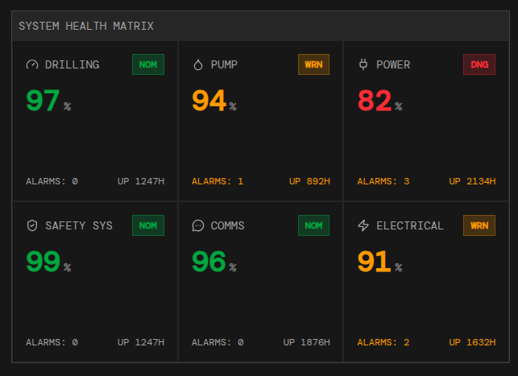

# 📊 Dashboard de Métricas

**SCADA Dashboard – Monitorização Industrial em Tempo Real**

Este layout representa um **dashboard SCADA (Supervisory Control and Data Acquisition)** moderno, desenvolvido para **monitorização e controlo em tempo real de sistemas industriais críticos**, como plataformas de perfuração, plantas energéticas ou ambientes industriais complexos..

O projeto também inclui um **componente reutilizável `<Separator />`** para dividir visualmente seções do dashboard.

---
## Visão Geral

O painel centraliza informações operacionais essenciais, permitindo **tomada de decisão rápida, precisa e segura**, através de indicadores visuais claros, gráficos em tempo real e sistemas de alerta.

---


## 🛠️ Tecnologias Utilizadas

- ⚛️ **React.js + TypeScript** – Biblioteca e tipagem para construção da interface.  
- 🎨 **TailwindCSS** – Estilização responsiva e moderna.  
- 🛠️ **Lucide Icons & Heroicons** – Ícones utilizados em cada card de métricas.  

---

## 📸 Capturas de Tela

- **Dashboard Principal**  


- **Card de Métricas**  



---

## 🚀 Como Rodar o Projeto

1. **Criar o Projeto com Vite**

  Clone o repositório do GitHub para o seu computador local:

   ```bash
   git clone https://github.com/Amiltonxavier/offshore-oil-dashboard.git
   
   cd offshore-oil-dashboard 
   ```
2. Instale as dependências do projeto:

```bash
  npm install
```

3. Execute a aplicação em desenvolvimento:

```bash
    npm run dev
```

